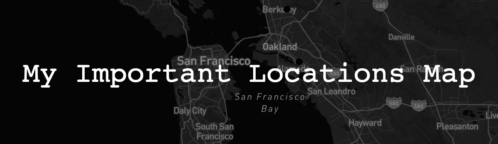
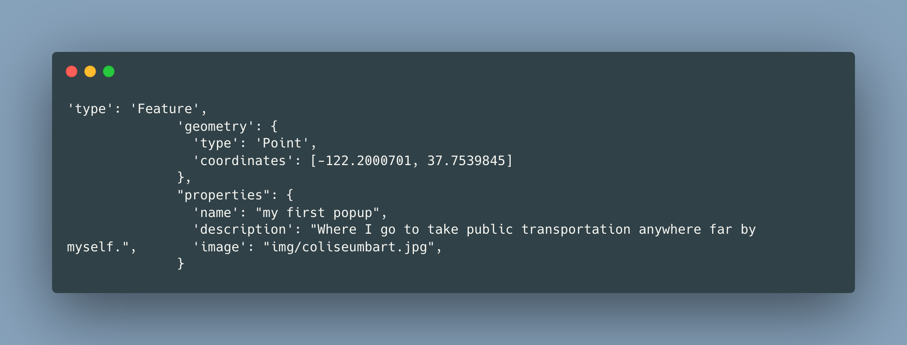

# My Important Locations Map

 

## What Is This Exactly?

[My Important Locations Map](https://chrissyswissy.github.io/my-first-map/) is an interactive web-app that showcases a map including some locations specifically in the Bay Area that I hold dearly to me. 

In this map, you can: 
1. **Look around the Bay Area** by staying near the San Francisco Bay. 
2. **Look at other areas** on the map if desired.
3. **See any highlighted points on the map** that appear as red circles.

Demo:

## Tech Stack

Tools I Used to Build This App:
1. [Visual Studio Code](https://code.visualstudio.com/download) IDE with [Live Server](https://marketplace.visualstudio.com/items?itemName=ritwickdey.LiveServer) and [Markdown All In One](https://marketplace.visualstudio.com/items?itemName=yzhang.markdown-all-in-one) extensions to build the map code.
2. [Mapbox GL J5](https://docs.mapbox.com/mapbox-gl-js/guides/) library to find a map preset to style my map.
3. [Google Maps](https://google.com/maps) to get the exact coordinates of my selected locations.
4. [GitHub Pages](https://docs.github.com/en/pages/getting-started-with-github-pages/creating-a-github-pages-site) to upload my map.

## Code Spotlight

One piece of code in this I want to put out into the spotlight is the first popup at the Coliseum BART station.

You may see that there is a red dot that shows information of a location when clicked. How did I do this you may wonder?

Here's the code (pop up example can be seen in the demo GIF):

_I got the exact coordinates of the Coliseum BART station and pasted it into the code where the point would be located. Then I put some information of the station and boom! A pop up._

## Why Build This Exactly?

I personally built this map to share some things about myself and the area of my origin. This is meant for a class project of mine, but I still had fun learning new things within this project and am glad to share with you, the reader, some stuff about myself even if it's small.

## Contributions Info

Feel free to do anything with this code, really. You can use it to help with any kind of project, copy it, you name it. Make a map that lists important landmarks if you may with this code.

Shoutout @domlet for the repo I forked to make this map. Very appreciated.
